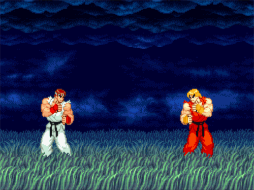

<h1 align="left">Juan Passos</h1>

## Hello, Guys!
I am 21 years old, living in São Carlos-SP, a programming enthusiast who loves jiu-jitsu! Currently, I see studies as an extension of the mat, where discipline, perseverance, and learning from mistakes are key. This mindset makes me love programming even more!

## Technologies and Tools:
 
 <code></code>
 <code></code>
 <code></code>
 <code></code>
 <code></code>
 <code></code>

## Social Networks:

  
  
     

## GitHub Stats:
 

  
  

